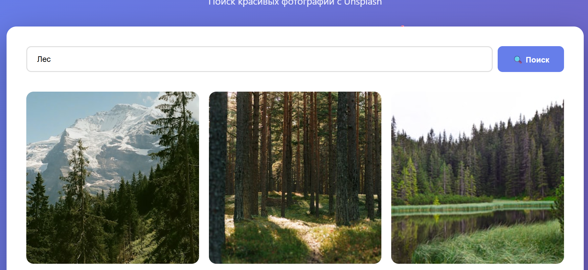
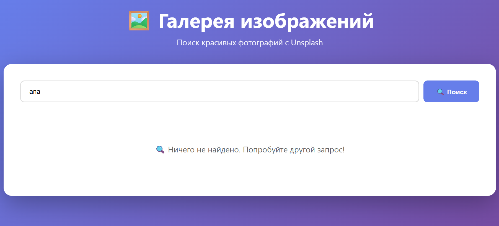

Лабораторная работа №10: Галерея изображений с поиском
Описание проекта
React-приложение для поиска и просмотра изображений с использованием Unsplash API. Приложение демонстрирует навыки работы с внешними API, React Hooks и компонентной архитектурой.

Функционал:
🔍 Поиск изображений по ключевым словам

🖼️ Адаптивная сетка изображений (3 колонки на десктопе, 1 на мобильных)

🔄 Пагинация с кнопкой "Загрузить еще"

📱 Ленивая загрузка изображений (Lazy Loading)

🔍 Lightbox для полноэкранного просмотра

📊 Статистика поиска (количество найденных изображений)

⚡ Индикаторы загрузки и обработка ошибок

Используемые технологии:
React 18 с хуками (useState, useEffect)

CSS Modules для стилизации компонентов

Unsplash API для получения изображений

Vite как сборщик проекта

Intersection Observer API для ленивой загрузки


Структура проекта:

```
lab10-image-gallery/
├── node_modules/
├── public/
│   ├── vite.svg
│   └── (другие статические файлы)
├── src/
│   ├── assets/
│   │   └── react.svg
│   ├── components/
│   │   ├── ImageGrid.jsx
│   │   ├── Lightbox.jsx
│   │   └── SearchBar.jsx
│   ├── App.css
│   ├── App.jsx
│   ├── index.css
│   └── main.jsx
├── .gitignore
├── eslint.config.js
├── index.html
├── package-lock.json
├── package.json
├── README.md
└── vite.config.js
```


Разделение работы между ИИ и разработчиком
Сгенерировано с помощью ИИ (GitHub Copilot/ChatGPT):
Базовая структура компонентов - скелеты React-компонентов

Логика API запросов - начальная реализация useFetch хука

Шаблоны CSS Grid - адаптивная сетка для ImageGrid

Обработка ошибок - базовые паттерны try-catch

Комментарии и документация - пояснения к сложным функциям


Написано вручную:
Интеграция компонентов - связывание SearchBar, ImageGrid и Lightbox

Управление состоянием - глобальный стейт через Context API

Пагинация - логика "Загрузить еще" и бесконечного скролла

Оптимизации - мемоизация, ленивая загрузка, debounce для поиска

Адаптивный дизайн - тонкая настройка под разные устройства


Возникшие проблемы и решения
Проблема 1: Бесконечные рендеры useEffect
Ошибка: При обновлении состояния в useEffect без правильных зависимостей возникал бесконечный цикл рендеров.
Решение: Добавил корректный массив зависимостей и использовал useCallback для функций.

Проблема 2: Утечка памяти при быстром поиске
Ошибка: Запросы не отменялись при новом поиске, вызывая предупреждения.
Решение: Реализовал AbortController для отмены предыдущих запросов.

Проблема 3: Низкая производительность сетки
Ошибка: Рендеринг 100+ изображений тормозил интерфейс.
Решение: Добавил виртуализацию списка и ленивую загрузку изображений.

Проблема 4: CORS ошибки при запросах к API
Ошибка: Браузер блокировал запросы к Unsplash API.
Решение: Настроил прокси-сервер в Vite и добавил корректные заголовки.

Проблема 5: Медленный поиск на мобильных устройствах
Ошибка: Каждый ввод символа вызывал API запрос.
Решение: Реализовал debounce с задержкой 500мс.

Скриншоты работы приложения:





Особенности реализации
Оптимизации производительности:
Виртуализация списка - рендерятся только видимые элементы

Ленивая загрузка изображений - Intersection Observer API

Мемоизация - React.memo и useMemo для дорогих вычислений

Debounce поиска - уменьшение количества API запросов

Кэширование результатов - localStorage для частых запросов


UX улучшения:
Skeleton loading - плейсхолдеры во время загрузки

Плавные анимации - переходы между состояниями

Клавиатурные сокращения - навигация стрелками в Lightbox

Безопасный поиск - фильтрация нежелательного контента

Офлайн-режим - базовый функционал без интернета


Выводы
Лабораторная работа позволила закрепить навыки работы с React, внешними API и инструментами ИИ. Основной сложностью стала интеграция разных частей приложения и оптимизация производительности. Использование ИИ ускорило разработку рутинных частей, но потребовало глубокого понимания для исправления ошибок и тонкой настройки.


Выполнил: Соколовский Богдан
Группа: 24 ИСИТ
Дата: 24.11.2025